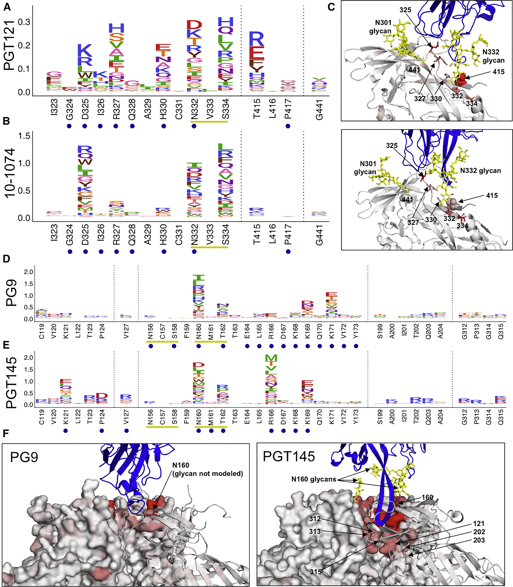
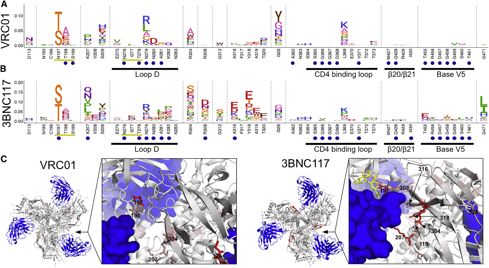
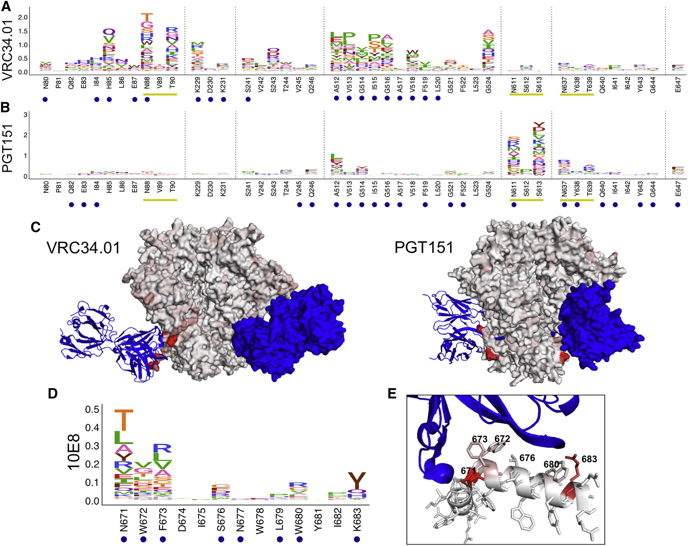

## [An Antigenic Atlas of HIV-1 Escape from Broadly Neutralizing Antibodies Distinguishes Functional and Structural Epitopes](https://research.fhcrc.org/content/dam/stripe/bloom/labfiles/publications/Dingens2019.pdf)

Adam S. Dingens, Dana Arenz, Haidyn Weight, Julie Overbaugh, Jesse D. Bloom

### Abstract
> Anti-HIV broadly neutralizing antibodies (bnAbs)
have revealed vaccine targets on the virus’s envelope (Env) protein and are themselves promising immunotherapies. The efficacy of bnAb-based therapies and vaccines depends in part on how readily
the virus can escape neutralization. Although structural studies can define contacts between bnAbs
and Env, only functional studies can define mutations
that confer escape. Here, we mapped how all
possible single amino acid mutations in Env affect
neutralization of HIV by nine bnAbs targeting five epitopes. For most bnAbs, mutations at only a small
fraction of structurally defined contact sites mediated escape, and most escape occurred at sites
near, but not in direct contact with, the antibody.
The Env mutations selected by two pooled bnAbs
were similar to those expected from the combination
of the bnAbs’s independent action. Overall, our mutation-level antigenic atlas provides a comprehensive dataset for understanding viral immune escape
and refining therapies and vaccines.

### Figure 3: Escape from V3-Glycan Supersite and V2 Apex bnAbs.

>(A and B) Escape profiles for V3-glycan supersite bnAbs PGT121 (A) and 10-1074 (B). Letter heights indicate the excess fraction surviving for each mutation. Blue circles indicate structurally defined contact sites, and yellow underlines indicate a N-linked glycosylation motif. Logoplots that show escape across Env are in Data S1.  
(C) V3-glycan supersite antibodies are shown in blue, and Env is colored according to the maximum excess fraction surviving at each site. Note that for PGT121, the closely related clonal variant PGT122 structure is used in lieu of a PGT121 structure (PDB: 5FYL and 5T3Z, respectively).   
(D and E) Escape profiles of V2 apex antibodies PG9 (D) and PGT145 (E) presented in the same manner as (A) and (B).   
(F) V2 apex antibodies are shown in blue, and Env is colored according to the maximum excess fraction surviving at each site (PDB: 5VJ6 and 5V8L, respectively). Median values across all biological replicates were plotted; see Figure S1 for the number of experimental replicates. See also Figures S2 and S3.

Below are the `dms-view` versions:

- [Figure 3A (PGT121)](https://jbloomlab.github.io/dms-view/?markdown-url=https%3A%2F%2Fjbloomlab.github.io%2Fdms-view%2F_data%2FHIV%2Fdingens2019antigenic.md&pdb-url=https%3A%2F%2Fjbloomlab.github.io%2Fdms-view%2F_data%2FHIV%2F5FYL_AbsRemoved.pdb&data-url=https%3A%2F%2Fjbloomlab.github.io%2Fdms-view%2F_data%2FHIV%2FHIV_dms-view.csv&condition=PGT121&site_metric=site_mediansitediffsel&mutation_metric=mut_meanmutdiffsel&selected_sites=323%2C324%2C325%2C326%2C327%2C328%2C329%2C330%2C331%2C332%2C333%2C334%2C415%2C417%2C441)
- [Figure 3B (10-1074)](https://jbloomlab.github.io/dms-view/?markdown-url=https%3A%2F%2Fjbloomlab.github.io%2Fdms-view%2F_data%2FHIV%2Fdingens2019antigenic.md&pdb-url=https%3A%2F%2Fjbloomlab.github.io%2Fdms-view%2F_data%2FHIV%2F5FYL_AbsRemoved.pdb&data-url=https%3A%2F%2Fjbloomlab.github.io%2Fdms-view%2F_data%2FHIV%2FHIV_dms-view.csv&condition=101074&site_metric=site_mediansitediffsel&mutation_metric=mut_meanmutdiffsel&selected_sites=323%2C324%2C325%2C326%2C327%2C328%2C329%2C330%2C331%2C332%2C333%2C334%2C415%2C417%2C441)
- [Figure 3D (PG9)](https://jbloomlab.github.io/dms-view/?markdown-url=https%3A%2F%2Fjbloomlab.github.io%2Fdms-view%2F_data%2FHIV%2Fdingens2019antigenic.md&pdb-url=https%3A%2F%2Fjbloomlab.github.io%2Fdms-view%2F_data%2FHIV%2F5FYL_AbsRemoved.pdb&data-url=https%3A%2F%2Fjbloomlab.github.io%2Fdms-view%2F_data%2FHIV%2FHIV_dms-view.csv&condition=PG9&site_metric=site_mediansitediffsel&mutation_metric=mut_meanmutdiffsel&selected_sites=119%2C120%2C121%2C122%2C123%2C124%2C125%2C127%2C156%2C158%2C159%2C160%2C161%2C162%2C163%2C164%2C165%2C166%2C167%2C168%2C169%2C170%2C171%2C172%2C173%2C199%2C200%2C201%2C202%2C203%2C204%2C312%2C313%2C314%2C315)
- [Figure 3E (PGT145)](https://jbloomlab.github.io/dms-view/?markdown-url=https%3A%2F%2Fjbloomlab.github.io%2Fdms-view%2F_data%2FHIV%2Fdingens2019antigenic.md&pdb-url=https%3A%2F%2Fjbloomlab.github.io%2Fdms-view%2F_data%2FHIV%2F5FYL_AbsRemoved.pdb&data-url=https%3A%2F%2Fjbloomlab.github.io%2Fdms-view%2F_data%2FHIV%2FHIV_dms-view.csv&condition=PGT145&site_metric=site_mediansitediffsel&mutation_metric=mut_meanmutdiffsel&selected_sites=119%2C120%2C121%2C122%2C123%2C124%2C125%2C127%2C156%2C158%2C159%2C160%2C161%2C162%2C163%2C164%2C165%2C166%2C167%2C168%2C169%2C170%2C171%2C172%2C173%2C199%2C200%2C201%2C202%2C203%2C204%2C312%2C313%2C314%2C315)

### Figure 4: Escape from CD4bs bnAbs.

> (A and B) Escape profiles for CD4bs bnAbs VRC01 (A) and 3BNC117 (B). Letter heights indicate the excess fraction surviving for each mutation. Blue circles
indicate structurally defined contact sites, and yellow underlines indicate a N-linked glycosylation motif. Portions of the canonical CD4bs epitope are underlined in
black and labeled. Logoplots that show escape across Env are in Data S1.
(C) Antibodies are shown in blue, and Env is colored according to the average fraction surviving at each site (PDB: 5FYK and 5V8M, respectively). Median values
across all biological replicates were plotted; see Figure S1 for the number of experimental replicates. See also Figures S2 and S3.

Below are the `dms-view` versions:

- [Figure 4A (VRCO1)](https://jbloomlab.github.io/dms-view/?markdown-url=https%3A%2F%2Fjbloomlab.github.io%2Fdms-view%2F_data%2FHIV%2Fdingens2019antigenic.md&pdb-url=https%3A%2F%2Fjbloomlab.github.io%2Fdms-view%2F_data%2FHIV%2F5FYL_AbsRemoved.pdb&data-url=https%3A%2F%2Fjbloomlab.github.io%2Fdms-view%2F_data%2FHIV%2FHIV_dms-view.csv&condition=VRC01&site_metric=site_mediansitediffsel&mutation_metric=mut_meanmutdiffsel&selected_sites=113%2C195%2C196%2C197%2C198%2C199%2C207%2C208%2C209%2C275%2C276%2C277%2C278%2C279%2C280%2C281%2C282%2C283%2C304%2C308%2C312%2C316%2C317%2C318%2C319%2C320%2C326%2C362%2C363%2C364%2C365%2C366%2C367%2C368%2C369%2C370%2C371%2C372%2C373%2C427%2C428%2C429%2C430%2C455%2C456%2C457%2C458%2C459%2C460%2C461%2C471)
- [Figure 4B (3BNC117)](https://jbloomlab.github.io/dms-view/?markdown-url=https%3A%2F%2Fjbloomlab.github.io%2Fdms-view%2F_data%2FHIV%2Fdingens2019antigenic.md&pdb-url=https%3A%2F%2Fjbloomlab.github.io%2Fdms-view%2F_data%2FHIV%2F5FYL_AbsRemoved.pdb&data-url=https%3A%2F%2Fjbloomlab.github.io%2Fdms-view%2F_data%2FHIV%2FHIV_dms-view.csv&condition=3BNC117&site_metric=site_mediansitediffsel&mutation_metric=mut_meanmutdiffsel&selected_sites=113%2C195%2C196%2C197%2C198%2C199%2C207%2C208%2C209%2C275%2C276%2C277%2C278%2C279%2C280%2C281%2C282%2C283%2C304%2C308%2C312%2C316%2C317%2C318%2C319%2C320%2C326%2C362%2C363%2C364%2C365%2C366%2C367%2C368%2C369%2C370%2C371%2C372%2C373%2C427%2C428%2C429%2C430%2C455%2C456%2C457%2C458%2C459%2C460%2C461%2C471)

### Figure 5: Escape from Fusion Peptide-Interface and MPER bnAbs.

> (A and B) Escape profiles for fusion peptide and gp120-gp41 interface bnAbs VRC34.01 (A) and PGT151 (B). Letter heights indicate the excess fraction surviving
for each mutation. Logoplots that show escape across Env are in Data S1.
(C) Fusion peptide antibodies are shown in blue, and Env is colored according to the maximum excess fraction surviving at each site (PDB: 5I8H and 5FUU,
respectively).
(D) Escape profile for MPER bnAb 10E8 presented in the same manner as in (A) and (B).
(E) 10E8 is shown in blue, and the MPER peptide is colored according to the maximum excess fraction surviving at each site (PDB: 4G6F). Median values across
all biological replicates were plotted; see Figure S1 for the number of experimental replicates. See also Figures S2 and S3.

Below are the `dms-view` versions:

- [Figure 5A (VRC34.01)](https://jbloomlab.github.io/dms-view/?markdown-url=https%3A%2F%2Fjbloomlab.github.io%2Fdms-view%2F_data%2FHIV%2Fdingens2019antigenic.md&pdb-url=https%3A%2F%2Fjbloomlab.github.io%2Fdms-view%2F_data%2FHIV%2F5FYL_AbsRemoved.pdb&data-url=https%3A%2F%2Fjbloomlab.github.io%2Fdms-view%2F_data%2FHIV%2FHIV_dms-view.csv&condition=VRC34&site_metric=site_mediansitediffsel&mutation_metric=mut_meanmutdiffsel&selected_sites=80%2C82%2C83%2C84%2C85%2C86%2C87%2C88%2C89%2C90%2C229%2C230%2C231%2C241%2C242%2C243%2C244%2C245%2C246%2C518%2C519%2C520%2C521%2C522%2C523%2C524%2C611%2C612%2C613%2C637%2C638%2C639%2C640%2C641%2C642%2C643%2C644%2C647)
- [Figure 5B (PGT151)](https://jbloomlab.github.io/dms-view/?markdown-url=https%3A%2F%2Fjbloomlab.github.io%2Fdms-view%2F_data%2FHIV%2Fdingens2019antigenic.md&pdb-url=https%3A%2F%2Fjbloomlab.github.io%2Fdms-view%2F_data%2FHIV%2F5FYL_AbsRemoved.pdb&data-url=https%3A%2F%2Fjbloomlab.github.io%2Fdms-view%2F_data%2FHIV%2FHIV_dms-view.csv&condition=PGT151&site_metric=site_mediansitediffsel&mutation_metric=mut_meanmutdiffsel&selected_sites=80%2C82%2C83%2C84%2C85%2C86%2C87%2C88%2C89%2C90%2C229%2C230%2C231%2C241%2C242%2C243%2C244%2C245%2C246%2C518%2C519%2C520%2C521%2C522%2C523%2C524%2C611%2C612%2C613%2C637%2C638%2C639%2C640%2C641%2C642%2C643%2C644%2C647)
